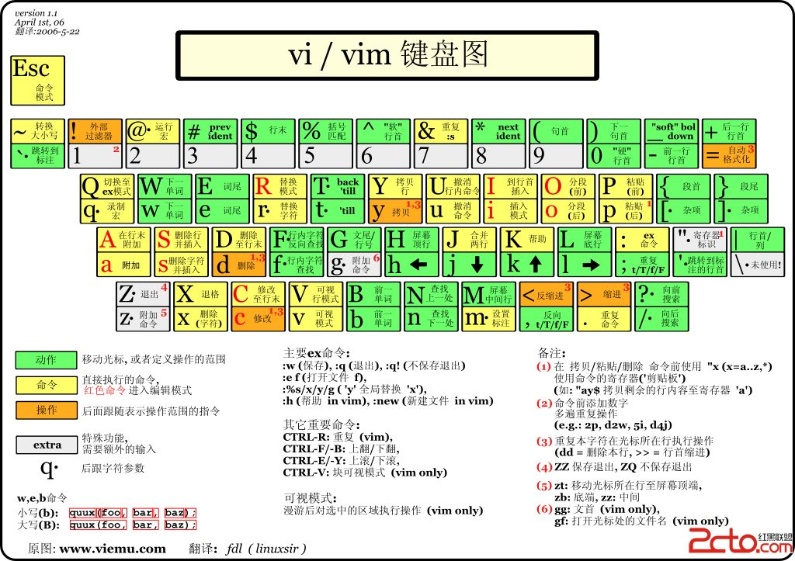

# vim

## ~/.vimrc

## vim command line arguments in shell

```text
   -o[N]		Open N windows (default: one for each file)
   -O[N]		Like -o but split vertically
   +<lnum>		Start at line <lnum>
   +			Start at end of file
   -h  or  --help	Print Help (this message) and exit
   --version		Print version information and exit
```

## vim shortcut in vim terminal

#### Searching
#### Inserting
- A: 在当前行尾进入编辑状态
- I: 在当前行首进入编辑状态
- i: 在当前光标之前进入编辑状态
- a: 在当前光标之后进入编辑状态
- o: 在下一行行首进入编辑状态
- O: 在上一行行首进入编辑状态

#### Replacing

- 合并行: `:r1,r2j` example: `:1,12j`
- 合并2行: J命令 将当前行与下一行合并
- 单个字母替换: r+替换字母
- 

#### Selecting
- 


#### Copying
#### Pasting
#### Deleting
#### Paging
- A 当前行尾进入编辑状态, 另见 a,I,i,O,o
- a 当前光标之后进入编辑状态, 另见 A,I,i,O,o
- B 将当前光标移动到上一个段落句首首, 另见 b
- b 将当前光标移动到上一个单词词首, 另见 B
- C
- c
- D 删除光标到行尾的所有字符
- d
- E
- e
- F
- f
- G 跳转到最后一行第一列
- g
- H  跳转到本页第一行
- h 光标前移一个字母, 另见 j k l
- I 当前行首进入编辑状态, 另见 A, a,i, O, o
- i 当前光标之前进入编辑状态, 另见 a, A, I, o, O
- J
- j 光标移动到下一行, 另见 h k l
- K
- k 光标移动到上一行, 另见 h k l
- L
- l 光标后移一个字母 另见 h j k
- M
- m
- N
- n
- O 在上一行行首进入编辑状态
- o 在下一行行首进入编辑状态
- P 
- p
- Q
- q
- R
- r 替换当前光标处字母
- S
- s
- T
- t
- u
- v
- V
- W 跳转到下一句句首
- w 跳转到下一个单词词首
- X 删除光标前面一个字符, 回退删除
- x 删除当前字符, 
- Y
- y
- Z
- z
- gg 回到第一行第一列
- dd 删除一行

## vim command in vim terminal

- format json data: :%!python -m json.tool

## vim plugin

## Appendix

#### vim --help

```text
VIM - Vi IMproved 8.0 (2016 Sep 12, compiled Nov 29 2017 18:37:46)

usage: vim [arguments] [file ..]       edit specified file(s)
   or: vim [arguments] -               read text from stdin
   or: vim [arguments] -t tag          edit file where tag is defined
   or: vim [arguments] -q [errorfile]  edit file with first error

Arguments:
   --			Only file names after this
   -v			Vi mode (like "vi")
   -e			Ex mode (like "ex")
   -E			Improved Ex mode
   -s			Silent (batch) mode (only for "ex")
   -d			Diff mode (like "vimdiff")
   -y			Easy mode (like "evim", modeless)
   -R			Readonly mode (like "view")
   -Z			Restricted mode (like "rvim")
   -m			Modifications (writing files) not allowed
   -M			Modifications in text not allowed
   -b			Binary mode
   -l			Lisp mode
   -C			Compatible with Vi: 'compatible'
   -N			Not fully Vi compatible: 'nocompatible'
   -V[N][fname]		Be verbose [level N] [log messages to fname]
   -D			Debugging mode
   -n			No swap file, use memory only
   -r			List swap files and exit
   -r (with file name)	Recover crashed session
   -L			Same as -r
   -T <terminal>	Set terminal type to <terminal>
   --not-a-term		Skip warning for input/output not being a terminal
   --ttyfail		Exit if input or output is not a terminal
   -u <vimrc>		Use <vimrc> instead of any .vimrc
   --noplugin		Don't load plugin scripts
   -p[N]		Open N tab pages (default: one for each file)
   -o[N]		Open N windows (default: one for each file)
   -O[N]		Like -o but split vertically
   +			Start at end of file
   +<lnum>		Start at line <lnum>
   --cmd <command>	Execute <command> before loading any vimrc file
   -c <command>		Execute <command> after loading the first file
   -S <session>		Source file <session> after loading the first file
   -s <scriptin>	Read Normal mode commands from file <scriptin>
   -w <scriptout>	Append all typed commands to file <scriptout>
   -W <scriptout>	Write all typed commands to file <scriptout>
   -x			Edit encrypted files
   --startuptime <file>	Write startup timing messages to <file>
   -i <viminfo>		Use <viminfo> instead of .viminfo
   --clean		'nocompatible', Vim defaults, no plugins, no viminfo
   -h  or  --help	Print Help (this message) and exit
   --version		Print version information and exit
```


